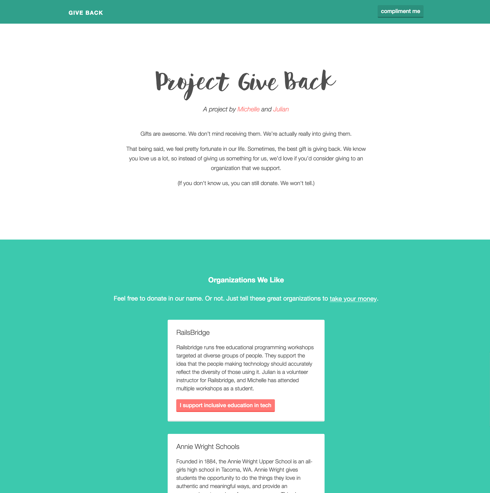
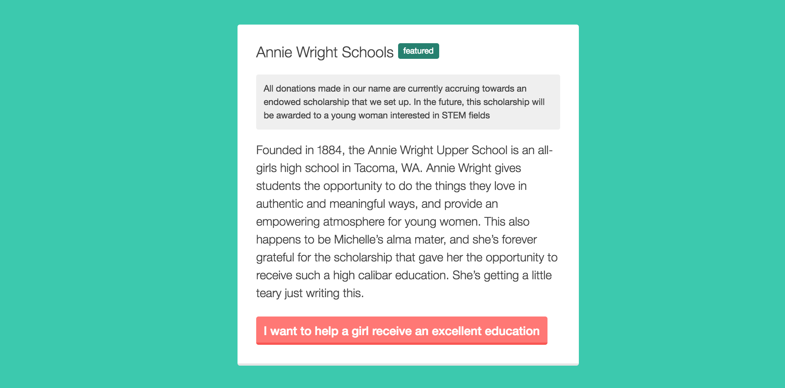
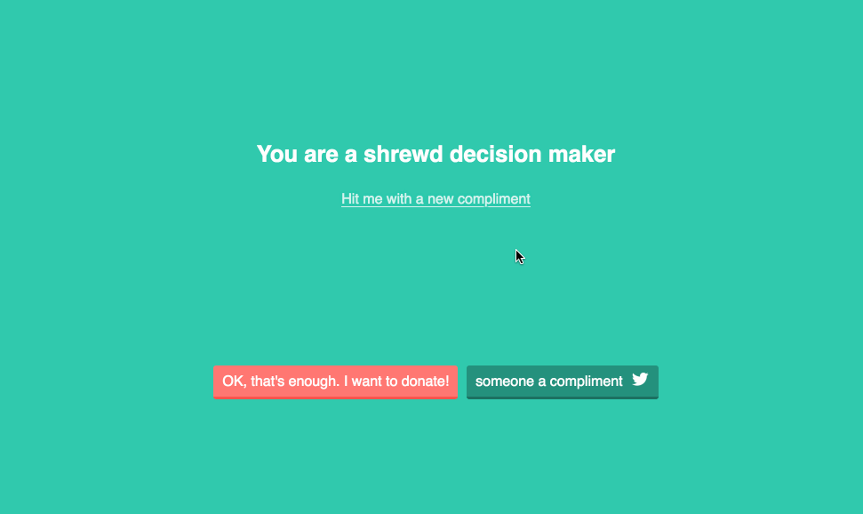
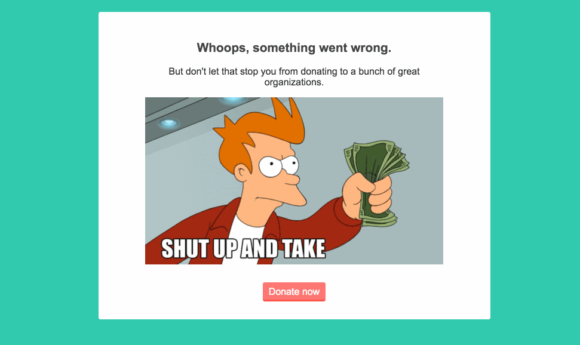

[] (https://codeclimate.com/github/venetucci/giveback)

A project by [Julian](http://twitter.com/jatescher) and [Michelle](http://twitter.com/mvenetucci). Take a moment to [visit the website](http://julianandmichellegiveback.com). 

Tell these great organizations to [take your money](http://i3.kym-cdn.com/photos/images/newsfeed/000/264/241/9e9.gif).

### Featured Organization:

We recently set up a fund that will turn into an endowed scholarship for a young
woman interested in STEM fields.

Site built with Rails, [Bourbon](http://bourbon.io/), and Neat, and hosted on Heroku.

